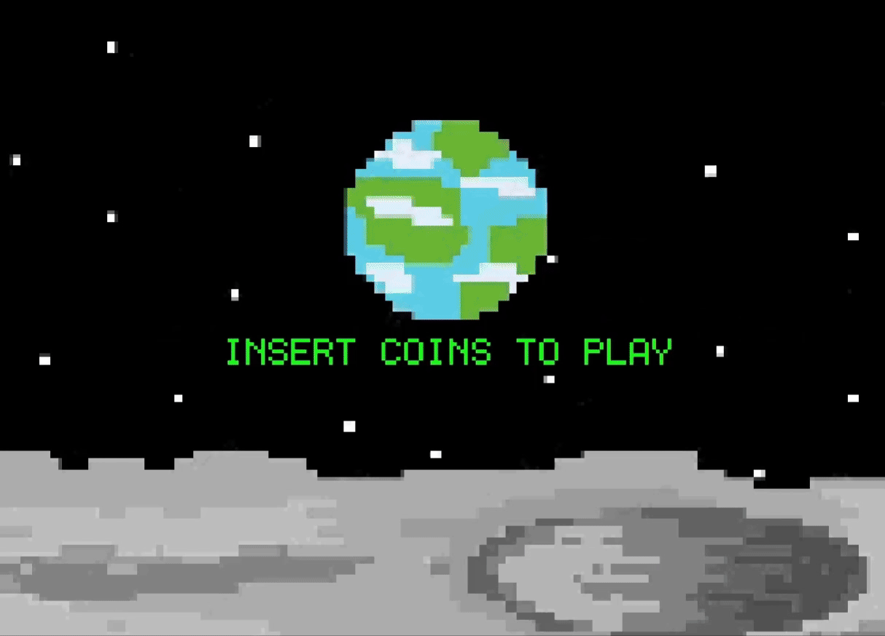

# GBA Alien Game 👾🚀  

Help Alien land his $10,000,000,000 spaceship without crashing!  
A GBA-style pixel game where timing and control are everything.  

[](https://en.wikipedia.org/wiki/C_(programming_language))



<br>

---

## 🎮 Game Controls

| Key          | Action          |
|--------------|------------------|
| **ENTER**     | Start game       |
| **BACKSPACE** | Restart game     |
| **← / →**     | Move left/right  |
| **S**         | Boost upward     |

---

## About the Game

This retro-style GBA game is a lighthearted challenge to safely guide Alien to the landing pad. One mistake could cost a trillion-dollar spaceship!

- Written in **C**
- Inspired by classic GBA aesthetics
- Simple controls, pixel-perfect precision

---

## 🚀 Getting Started

### Requirements

- C

### Installation

```bash
git clone https://github.com/your-username/gba-alien-game.git
cd gba-alien-game


---

## Repository Structure
gba-alien-game
├─ assets/              # Images and sound files
├─ alien_game.py        # Main game logic
├─ README.md            # You're here!
└─ Figures/
   └─ banner.png        # Game banner image
